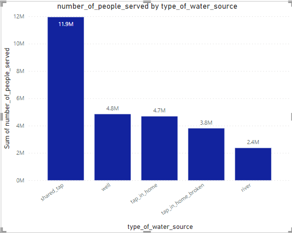
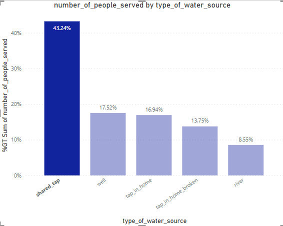

# VISUALIZING_MAJI_NDOGOs_PAST_PBI_PROJECT_1
## INTRODUCTION
The Maji Ndogo water crisis project that was analysed using SQL has shed light on several crucial aspects including the gender dynamics in water collection. The focus now is to effectively communicate findings. The report has to be clear, impactful, comprehensive and also to convey the full scope of the research and its implications. 

Using the aid of data visualization in Power BI, I will be I will be presenting complex data in an accessible manner which would be pivotal in crafting a report that informs and also help to understand the water access issues in Maji Ndogo.

## PROBLEM STATEMENT
I will be highlighting the survey data I worked on in SQL looking at the gender inequality in water access in Maji Ndogo, the 5th goal in the United Nations Sustainable Development Goals (SDGs).

The visualization will include:

1.	Most sources of water in Maji Ndogo
2.	Percentage of people using shared taps. 
3.	Percentage of population with water infrastructure in their homes. 
4.	Percentage of our people using dysfunctional systems and location.
5.	Percentage of people using wells
6.	Visualization of the queues.

## DATA SOURCING
The data used was made available by Explore AI on [google drive](https://drive.google.com/file/d/1HqxFD09_i7rEXqZaBrkQ1nPIK4bkPAtC/view?usp=drive_link).

One of the visuals with the most impact is a map. Links were provided to create a custom map using JSON map file and an image of Maji Ndogo. The links are:

For the map of Maji Ndogo image, it can be downloaded [here](https://drive.google.com/file/d/15pUXLQuf6p06_ygPjbkY3UJ7Z7FXlfsp/view?usp=sharing) 

For the JSON file, it can be downloaded from [here](https://drive.google.com/file/d/1TGqT7SHLU9y00GazEkxhQzGit2KEPfmp/view?usp=sharing)

## ABOUT THE DATA
Here is a short explanation of the new data: 

1.	hour_of_day - The hour of day at the time_of_record. This will help us aggregate by the hour of the day. 
2.	day_of_week - The day of the week from the time_of_record. This will help us aggregate by the day of the week. 
3.	percent_male - The percentage of men in the queue at the time_of_record. 
4.	percent_female - The percentage of men in the queue at the time_of_record. 
5.	percent_child - The percentage of men in the queue at the time_of_record.

## VISUALIZATION
The report comprises of 3 pages:
1.	National
2.	Broken_tap_maps
3.	Queue_times

## DATA ANALYSIS 
1.	Most sources of water in Maji Ndogo

A pie chart was created to illustrate the total Urban and Rural population split in Maji Ndogo. Using SUM(number_of_people_served), split by location_type.

  

It can be seen that more people live in the rural areas than the urban areas.

2.	Percentage of people using shared taps.
   
A column chart was created showing the total population using the various water sources. Using SUM(number_of_people_served), split by type_of_water_source.

number_of_shared_taps      |  percent_of_shared_taps         
:-------------------------:|:--------------------------------:                                       
       |  
  
More people use shared taps compared to the others. The least being the river. 43% might not seem to be a large number for shared taps but the next highest is the 18%. This indicates that shared taps is the major means of water supply in Maji Ndogo. The well and the tap in homes have close percentage number of users.

The pie chart and the column chart have an underlying relationship. Clicking on the shared_tap bar on the column chart, the rural highlight on the pie chart is larger than the urban one. This means there are more shared taps in the rural areas than in the urban areas.

  

3.	Percentage of population with water infrastructure in their homes. 

From the column chart highlighted, it can be seen that 17% of the population has taps fixed in their homes. The number of taps in home for the urban areas are higher to those in the rural areas.
  
  

