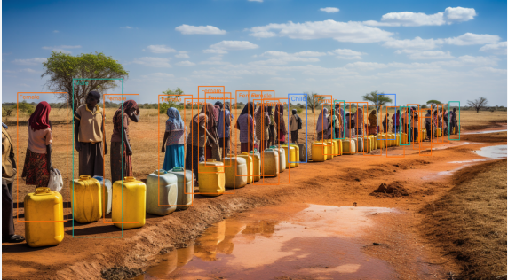
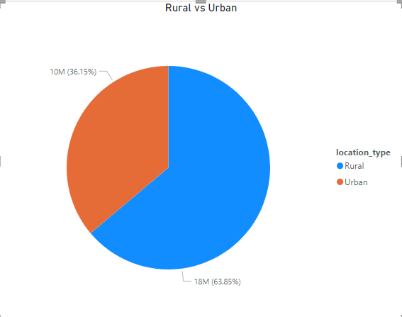
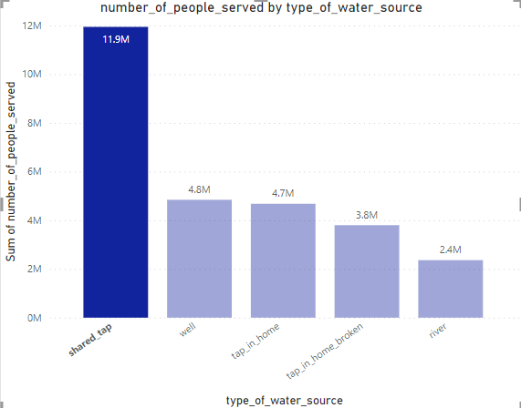
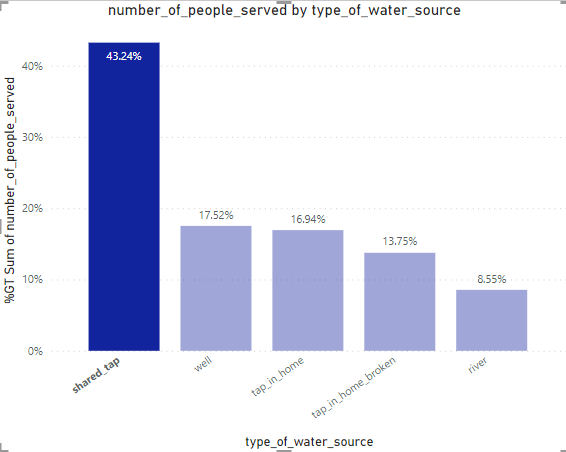
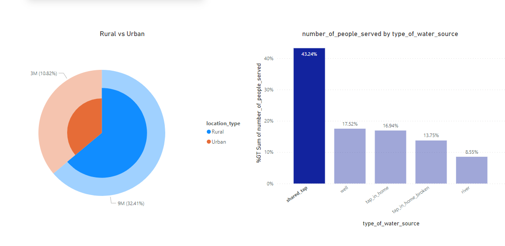
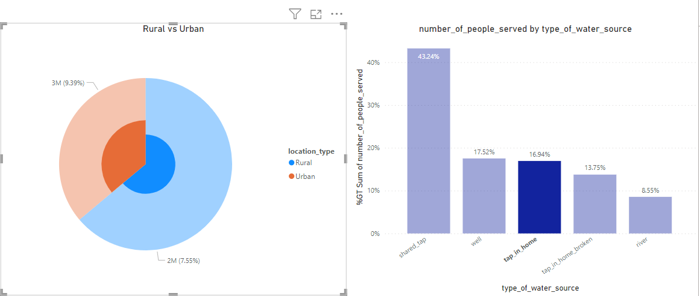
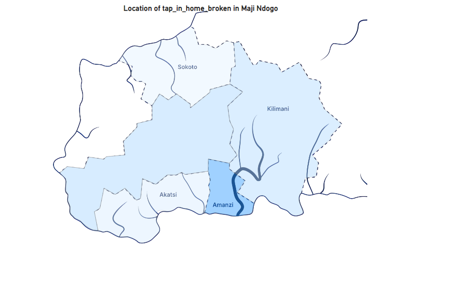
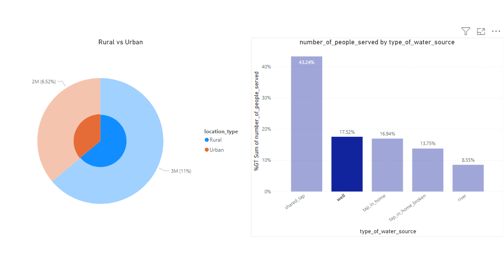
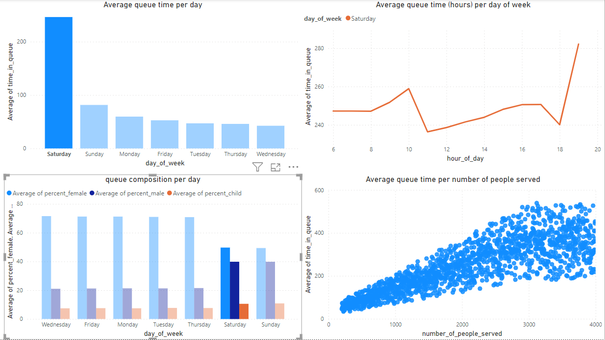
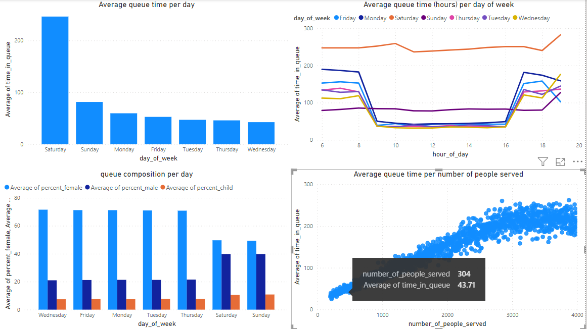

# VISUALIZING_MAJI_NDOGOs_PAST_PBI_PROJECT_1

_Picture_Credit: Explore AI_

## INTRODUCTION
The Maji Ndogo water crisis project that was analysed using SQL has shed light on several crucial aspects including the gender dynamics in water collection. The focus now is to effectively communicate findings. The report has to be clear, impactful, comprehensive and also to convey the full scope of the research and its implications. 

Using the aid of data visualization in Power BI, I will be I will be presenting complex data in an accessible manner which would be pivotal in crafting a report that informs and also help to understand the water access issues in Maji Ndogo. (This project is sectioned into 4 phases. This is the first.)

## PROBLEM STATEMENT
I will be highlighting the survey data I worked on in SQL looking at the gender inequality in water access in Maji Ndogo, the 5th goal in the United Nations Sustainable Development Goals (SDGs).

The visualization will include:

1.	Most sources of water in Maji Ndogo
2.	Percentage of people using shared taps. 
3.	Percentage of population with water infrastructure in their homes. 
4.	Percentage of our people using dysfunctional systems and location.
5.	Percentage of people using wells
6.	Visualization of the queues.

## DATA SOURCING
The data used was made available by Explore AI on [google drive](https://drive.google.com/file/d/1HqxFD09_i7rEXqZaBrkQ1nPIK4bkPAtC/view?usp=drive_link).

One of the visuals with the most impact is a map. Links were provided to create a custom map using JSON map file and an image of Maji Ndogo. The links are:

For the map of Maji Ndogo image, it can be downloaded [here](https://drive.google.com/file/d/15pUXLQuf6p06_ygPjbkY3UJ7Z7FXlfsp/view?usp=sharing) 

For the JSON file, it can be downloaded from [here](https://drive.google.com/file/d/1TGqT7SHLU9y00GazEkxhQzGit2KEPfmp/view?usp=sharing)

## ABOUT THE DATA
Here is a short explanation of the new data: 

1.	hour_of_day - The hour of day at the time_of_record. This will help us aggregate by the hour of the day. 
2.	day_of_week - The day of the week from the time_of_record. This will help us aggregate by the day of the week. 
3.	percent_male - The percentage of men in the queue at the time_of_record. 
4.	percent_female - The percentage of men in the queue at the time_of_record. 
5.	percent_child - The percentage of men in the queue at the time_of_record.

## VISUALIZATION
The report comprises of 3 pages:
1.	National
2.	Broken_tap_maps
3.	Queue_times

## DATA ANALYSIS 
1.	Most sources of water in Maji Ndogo

  A pie chart was created to illustrate the total Urban and Rural population split in Maji Ndogo. Using SUM(number_of_people_served), split by location_type.

  

  It can be seen that more people live in the rural areas than the urban areas.

2.	Percentage of people using shared taps.
   
  A column chart was created showing the total population using the various water sources. Using SUM(number_of_people_served), split by type_of_water_source.

number_of_shared_taps      |  percent_of_shared_taps         
:-------------------------:|:--------------------------------:                                       
            |
  
  More people use shared taps compared to the others. The least being the river. 43% might not seem to be a large number for shared taps but the next highest is the 18%. This indicates that shared taps is the major means of water supply in Maji Ndogo. The well and the tap in homes have close percentage number of users.

  The pie chart and the column chart have an underlying relationship. Clicking on the shared_tap bar on the column chart, the rural highlight on the pie chart is larger than the urban one. This means there are more shared taps in the rural areas than in the urban areas.

  

3.	Percentage of population with water infrastructure in their homes. 

  From the column chart highlighted, it can be seen that 17% of the population has taps fixed in their homes. The number of taps in home for the urban areas are higher to those in the rural areas.
  
  

4.	Percentage of people using dysfunctional systems like tap_in_home_broken.

  One of the visuals with the most impact is a map. Since Maji Ndogo isn't known, a custome map as to be used to visualise the data. In order to locate where the infrastructure is broken, maps are used. For the map of Maji Ndogo, custom map was made using a shape map by downloading the JSON file and the image map of Maji Ndogo.

  After visualizing the map using a custom map, the type_of_water_source was added to the filter pane and tap_in_home_broken was selected to only reveal the data where tap_in_home_broken was shown.

  

  From the map, it can be seen province by province where the broken taps were.

  Amazi is the top priority followed by KIlimani. Hovering over the map and selecting a province filtered all the results and included only that province.

5.	Percentage of people using wells.
   
  The national page indicated that 18% of the population uses well. With a larger population (as seen on the pie chart) found in the rural areas.

  

6.	Visualization of the queues.

  The visualizations for the queues resulted into 4 different visuals
  
  a.	A bar chart with average queues times per day of the week.
  
  b.	A line chart plotting the average queue times for the hour of the day and day of the week in separate colours.
  
  c.	A bar chart that shows the average composition of queues (percent_female, percent_male, percent_child) for each day of the week.
  
  d.	A scattered plot chart with average number_of_people_served per average time_in_queue. Filtering to where visit_count > 1.

  

  From these visuals, Saturday has very long queues. The queue time per hour graph indicate that the queues are similar on weekdays in the mornings and evenings, maybe before and after work hours and school hours but this is seen to be different on the weekends. The weekends have more consistent queue hours across the timelines.
  
  In the queue time per day graph, it can be seen that the average queue time plummeted, starting from 8:00am up until 4:00pm when the queue time spiked. This was constant across all weekdays. For Saturdays, the queue time dipped at 11:00am and 6:00pm. The queue time on Sunday was averagely consistent in contrast to other days of the week except for 6:00pm when the queue time began to lift. This might be in preparation for Monday, the start of the work week.

  

  Looking at the bar chart for queue composition, there is a gender disparity. Women queue more for water than men. On weekends there is a significant increase in the number of men who queue for water. It is also seen that children also go to collect water; this implies that the children go with their mothers to collect water.
  
Taking a look at the scatter plot, it can be seen that the relationship between the queue length and the time taken is mostly linear. It is revealed here that shared_tap serves 3000 people. It is noteworthy to say that the average queue_time shouldn’t be more than 30mins. So to get an average of 30mins, more taps has to be installed. From the graph, a tap serving 3000 people takes averagely 200mins, therefore, 1500 people served is 100 mins lesser. A break-down indicates that installing 10 taps will have 300 people served in 40 mins.

  

 Also from the scatter plot, at 3000 people served, the data begins to plateau. This might be logical because if queues are too long, people give up and return home or look for water elsewhere.

 ## CONCLUSION
  For shared_taps, 43% of the population uses shared taps. Days with the longest queues are on Saturdays, Sundays have the lesser but more consistent queues and queue times. People also tend to get water in the mornings and evenings on weekdays while they are more at the queues on Saturdays. 1 shared_tap serve up to 3000 people. On the map, the province with more broken tap was Amanzi. 17% of people has tap fixed in their homes. 18% of the population uses wells and more users of wells are found in the rural areas. In conclusion, the shared population in Maji Ndogo is approximately 28million with a 64% of the population living in the rural areas and 37% living in the urban areas.

## RECOMMENDATION
The following recommendation are stated from the project involving water crisis in Maji Ndogo:
1.	The average time to be spent in queues should not exceed 40mins.
2.	More taps should be installed in regions where the queues are longer and queue time is beyond 40mins
3.	During the weekdays, afternoon time is an ideal time to get water due to lesser queues
4.	Sundays can be used to obtain water.
5.	Amanzi should be the priority when fixing broken_taps_in_homes followed by kilimani.
6.	Until the shared taps are fixed, mornings and evenings should best be avoided by those who has manageable water to use.

_The next project will look at crime rate with respect to gender and queue time._
:---------------------------------------------------------------------------------------------------:
### END!
